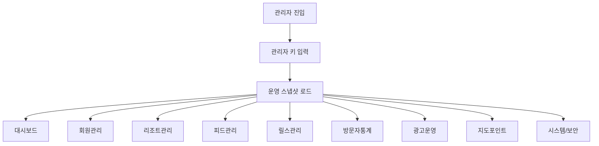

# Divergram 관리자 대시보드 설계안

> 목표: 운영자가 회원, 리조트, 피드, 릴스, 방문자 통계, 지도 포인트, 신고/자격증, 작업 큐를 한 화면에서 관리하고, 아직 API가 없는 기능은 대기 상태로 분리해 혼선을 줄인다.

## 1. 진입 경로
- 웹 콘솔: `adm.divergram.com`
- 보조 호스트: `admin.divergram.com`, `manager.divergram.com`
- 앱 내부 운영 화면: `src/screens/admin/AdminDashboardScreen.tsx`
- 웹 운영 콘솔: `src/components/AdminConsole.tsx`

## 2. 전반 구조

## 3. 홈 대시보드
- 전체 회원 수
- 리조트 회원 수
- 피드/릴스 콘텐츠 수
- 방문자 추정치
- 작업 큐 상태
- 지도 포인트 수
- 최근 신고/자격증/작업 상태 요약

## 4. 메뉴 구성

### 4-1. 회원 관리
- 일반회원 / 리조트회원 분리
- 차단/해제
- 이메일 인증 여부 확인
- 검색/필터
- 최근 가입자 보기

### 4-2. 리조트 관리
- 리조트 회원 목록
- 제휴 리조트 우선순위
- 국가/지역/주소/전화 정보 확인
- 리조트 카드 노출 순서 관리

### 4-3. 피드 관리
- 게시물 목록
- 공개/비공개 상태
- 삭제/검수/수정 동선
- 사진/영상/태그/좋아요/댓글 확인

### 4-4. 릴스 관리
- 릴스 전용 목록
- 세로 영상 검수
- 노출 우선순위 관리
- 광고 삽입 구간 확인

### 4-5. 방문자 통계
- 일별 추정 방문자
- 가입/게시물/상호작용 추세
- 최근 14일 성장 추이

### 4-6. 광고 운영
- 피드 중간 광고
- 릴스 중간 광고
- 지도 배너 광고
- 광고 슬롯/노출 위치/정렬/활성 상태를 `/api/admin/ads`와 연결해 운영 가능 상태로 관리

### 4-7. 지도 포인트
- 다이빙 포인트 마커
- 리조트 마커
- 운영 등록/숨김/정렬 기준

### 4-8. 시스템 / 보안
- 작업 큐
- 신고 처리
- 자격증 검토
- 서버 헬스체크
- 운영자 액션 이력

## 5. 연결된 운영 API
- `GET /api/admin/health`
- `GET /api/admin/stats`
- `GET /api/admin/growth`
- `GET /api/admin/users`
- `PATCH /api/admin/users/:userId/block`
- `GET /api/admin/certifications`
- `PATCH /api/admin/certifications/:certificationId/status`
- `GET /api/admin/reports`
- `PATCH /api/admin/reports/:reportId/status`
- `GET /api/admin/jobs`
- `POST /api/admin/jobs/dispatch`
- `GET /api/admin/map-points`
- `GET /api/admin/tables`
- `GET /api/admin/table/:name`

## 6. 현재 운영 연결 상태
- 회원관리: 연결됨
- 리조트관리: 연결됨
- 피드관리: 연결됨
- 릴스관리: 연결됨
- 방문자통계: 연결됨
- 지도포인트: 연결됨
- 시스템/보안: 연결됨
- 광고운영: 연결됨

## 7. 운영 시 체크 원칙
1. 실제 운영 테이블을 우선 조회한다.
2. 테스트 샘플은 배포/운영 경로에 섞지 않는다.
3. API가 없으면 화면만 먼저 만들고 상태를 `대기`로 남긴다.
4. 관리자 키 없이 진입하지 못하도록 한다.
5. 차단/상태변경/작업배포는 즉시 피드백을 보여준다.

## 8. 추천 추가 기능
- 대량 차단/복구
- 신고 큐 우선순위
- 콘텐츠 예약 노출
- 관리자 감사 로그
- CSV 내보내기
- 광고 슬롯 관리 API
- 실시간 이상징후 알림
- 운영자 역할 분리
